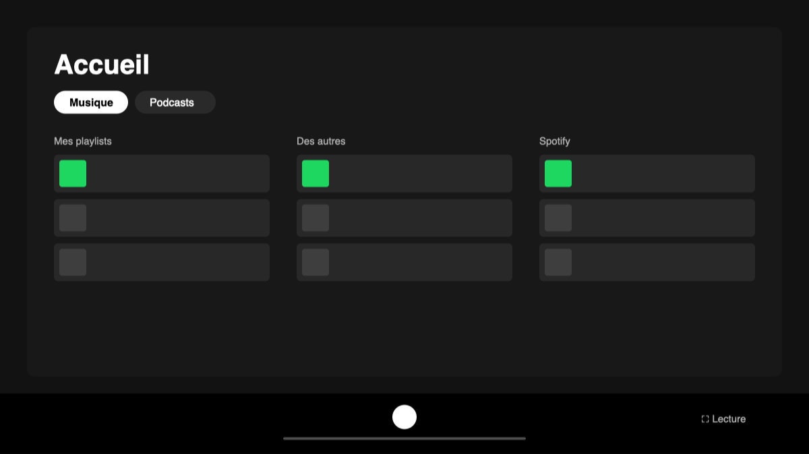

# Compact — Spicetify theme

**English** · [Français](README.fr.md)



A Spotify built around **your** library: a custom home page instead of recommendations, a fullscreen now-playing view with lyrics, and an interface stripped of what you don't use.

For the **Spotify desktop app downloaded from spotify.com** (not the Microsoft Store or Mac App Store version), on Mac or Windows. Built for Spotify 1.3 and Spicetify 2.45.

> The interface follows Spotify's language: French when Spotify is in French, English otherwise (see [Language](#language)).

## What it changes

### Home
- **Music / Podcasts & books tabs**, each with its own sub-menu: my playlists, my albums, listen later, mixes for me, new releases, discover. On the podcast side: new episodes, resume, your shows, audiobooks (yours and suggested ones), discover. Any section the theme doesn't recognize lands in Discover instead of disappearing.
- **My playlists in three columns**: yours, other people's, Spotify's.
- **Style filters** in every sub-menu, with a ▶ to shuffle a whole style. Styles come from your folders (see [Adapting it to your library](#adapting-it-to-your-library)).
  - **Sub-filters**: pick a style and its subfolders show up as a second row (Hip-hop › Trap US), each with its own ▶.
  - **Mixed playlists** (two clear styles, neither dominant, e.g. rap + electro) show up under both filters, wherever they're filed.
- **Play counts** on every playlist and album, and a *Most played* sort.
- **Tidy-up suggestions** (*Tidy up* button in My playlists):
  - playlists whose artists mostly belong to another style folder;
  - loose playlists at the library root with a clear style;
  - playlists not played in over a year, when Spotify knows the date;
  - **subfolders to create** in a broad style folder: groups of playlists that share their artists (rare artists weigh more). Each group comes with a suggested name you can edit, and you can drop playlists from it before clicking *Create subfolder*;
  - playlists at the top level of a style folder that are close to one of its existing subfolders.

  Each one gets a *Move to…* or *Archive* button (into an `ARCHIVES` folder), plus *Dismiss*. Nothing moves until you click.
- **Albums by release date**: *Release ↓* and *Release ↑* sorts.
- **3 slots at the top: Liked Songs + 2 playlists of your choice**. Empty dashed slots show where they go: right-click a playlist, album, artist, show or folder → *Pin to home*. Always on one line. Drag any card, Liked Songs included, to reorder them. Liked Songs is always there, with play or shuffle.

### Fullscreen playback
The fullscreen button in the player bar (or ⤢ in the Now Playing panel) opens a fullscreen view:
- large cover art and playback controls;
- **synced lyrics**: click a line to jump to it;
- **up next** list: click a track to skip to it.

Press Esc to close.

### Right-click
- **Everywhere**: home cards and the up-next list open Spotify's real context menu.
- **Listen later**: sets a track, album, playlist or artist aside without liking it. You'll find it in the *Later* tab, where anything you've played is marked *Played*. The clock in the playback view does the same for the current track.
- **Full discography** (on an artist, album or track): every release by the artist. Filter by albums, EPs, singles, compilations or already in your library, and sort by date.
- **Pin to home** / **Unpin from home**.

### Drag and drop
Drag a track (player bar, queue…) onto Liked Songs to like it, or onto one of your own playlists to add it without duplicates. Your own playlists are the ones in the *My playlists* column and your pinned cards.

### Automations
- **Seasons**: if your seasonal playlists live in a `SAISONS` folder, the playlist for the new season (French names: *automne '26*…) is created at the start of each astronomical season and pinned. The previous one is filed into `SAISONS`.
- **Startup**: Spicetify sometimes fails to initialize when Spotify launches. When it does, the interface reloads itself.

### Interface
- Left sidebar hidden: you navigate from the home page.
- *Studio* button removed.
- Duplicate Home button removed.
- Colored sticky header band removed on the home page.

## Install

The home page and the playback view are *custom apps*. Spicetify's Marketplace can't install those, so use the script.

Download the repo (**Code → Download ZIP**) and unzip it, or:
```bash
git clone https://github.com/Simon-Gaspar/spicetify-compact.git
```

**Mac**: open Terminal in the folder and run `./install.sh` (Homebrew required).

**Windows**
1. Double-click `install.cmd`. Don't run it as administrator. If Windows shows "Windows protected your PC", click "More info", then "Run anyway".
2. If the Spicetify installer offers to install the Marketplace, answer **N**.

The script installs Spicetify if needed, copies the theme, both pages and the extensions, then restarts Spotify.

**From the Marketplace**, only the theme and the extensions get installed. Without the custom apps, the left sidebar and Spotify's own home page stay as they are.

## Update

- **The theme**: get the latest version of the repo (`git pull`, or a new ZIP) and run the install script again.
- **After a Spotify update**, the changes are gone: run the script again, or `spicetify backup apply` (in Terminal or PowerShell).

Back to stock Spotify: `spicetify restore`.

**Update notice**: once a day, the theme reads `version.json` from this repo (nothing else is downloaded or run). When a newer version is out, a banner at the top of the home page says so; *Later* hides it for that version.

**Publishing a new version** (maintainer): bump `ACCUEIL_VERSION` at the top of `spicetify/Extensions/accueil-core.js` and `version` in `version.json` to the same number, optionally with a short note in `version.json` (`notes.en` / `notes.fr`), then push.

## Adapting it to your library

- **Styles**: one style = one top-level folder in your library, detected automatically (except `SAISONS`).
  - Without folders there are no style filters; a hint in the interface points this out. Everything else works.
  - Albums, mixes and discoveries are classified from their artists. Anything that fits no style goes into *Mixed*.
  - Subfolders inside a style folder become sub-filters (first level only; deeper folders count toward their parent). Subfolder suggestions show up for folders with at least 12 playlists at their top level, or that already have subfolders.
  - To keep only some folders or rename how they're displayed, edit `STYLE_LABELS` at the top of `CustomApps/accueil/index.js`, then run `spicetify apply`. The folder is `%APPDATA%\spicetify` on Windows and `~/.config/spicetify` on Mac. As soon as one folder from that list exists, only the listed folders count.
  - The analysis runs again every week.
- **Automatic seasons**: only active if you have a `SAISONS` folder at the root of your library. Without it, nothing is created.
- **Pins**: on first launch, they start from the items pinned in your Spotify library. After that, you choose.

## Language

French when Spotify is in French, English otherwise. To force a language, open the console (`spicetify enable-devtools`, then right-click → Inspect) and run `localStorage.setItem("accueil:lang", "en")` (or `"fr"`), then reload with Ctrl/Cmd+R. Style names come from your folder names and aren't translated.

## Kept on this computer

This data stays in Spotify on the computer where the theme is installed. It doesn't carry over to your phone or another computer.

| Data | Details |
|---|---|
| Play counts | One play = one time you start the playlist or album, on any device (Spotify syncs the last-played date). Two plays less than 30 min apart count as one. Counting starts at install. |
| Listen later | The *Listen later* list. |
| Pins | The cards at the top of the home page. |
| Styles, release dates | Cached for speed (styles are recomputed every week). |

## Troubleshooting

- **"Something went wrong" screen or incomplete home page at launch**: the theme reloads the interface by itself, up to 3 times. If it persists, quit and restart Spotify.
- **A feature disappears after a Spotify update**: a banner at the top of the home page flags it, with a notification once per version. For details, run `spicetify enable-devtools` and look for `[accueil]` messages in the console.

## Limitations

- No filter for AI-generated tracks: Spotify doesn't expose that information.
- The theme relies on Spotify's internal APIs, which sometimes change with its updates.
- Spicetify modifies the Spotify app. Spotify's terms of use don't allow that, although it's almost never enforced. Use at your own discretion.
